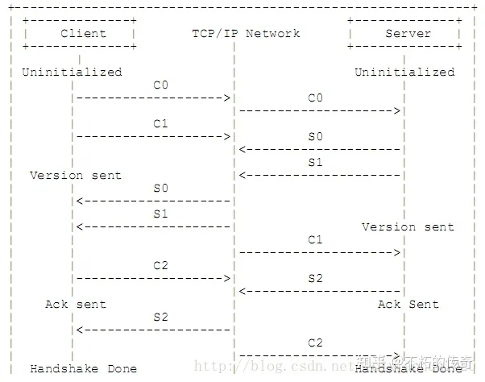
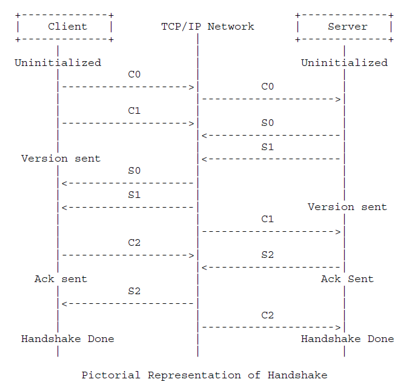
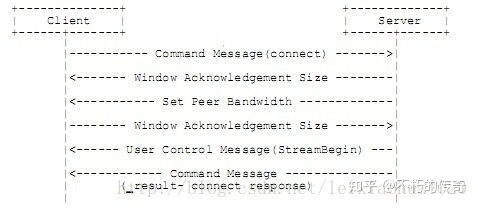
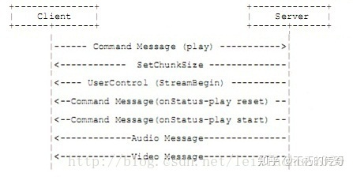
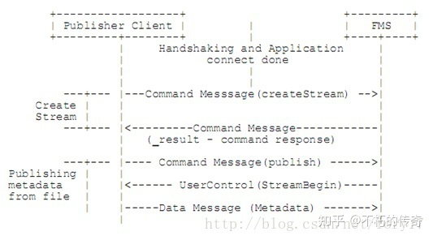

# RTMP client与RTMP server交互流程

播放一个RTMP协议的流媒体需要经过：`握手`、`建立链接`、`建立流`、`播放/发送`四个步骤。  
握手成功之后，需要在建立链接阶段去建立客户端和服务器之间的“网络链接”  
建立流阶段用于建立客户端和服务器之间的“网络流”。
播放阶段用于传输音视频数据。

## 握手 
这里的握手不同于其他协议的握手，它是由 3 个固定大小的块组成，而不是带有头部的可变大小的块。  客户端和服务器端都会发送 3 个固定大小的块。客户端发送的称为 C0/C1/C2，服务器端发送的称为S0/S1/S2。  

服务器和客户端需要发送大小固定的三个数据块， 具体步骤如下： 

1. 握手开始于客户端发送C0、C1块。服务器收到C0或C1后发送S0和S1。
2. 当客户端收齐S0和S1后，开始发送C2， 必须接收到服务器端发送的S2后才能发送其他数据。当服务器收齐C0和C1后，开始发送S2。
3. 当客户端和服务器分别收到S2和C2后，握手完成。

##### 数据格式说明
C0 和 S0 是一个8-bit的整数字段
C1 和 S1 是一个1536 byte 的序列，其中 4 byte 是表示时间，4 byte 全部填0，剩余部分填写其他值。
C2 和 S2 是对 C1 和 S1 的一个对等。  

  
  

> 说明： 
* 未初始化阶段(Uninitialized):协议版本会在该阶段发送。客户端和服务器端都处于未初始化阶段。 
* 客户端在 C0 包里发送协议版本，如果服务器端支持该协议，就会发送 S0 和 S1 作为反馈，如果不支持，就会终止连接。  
* 版本发送阶段(Version Sent): Uninitialized 阶段后，客户端和服务器端都会进入 Version Sent 阶段。客户端等待服务器端发送的 S1 包，服务器端等待客户端发送的 C1 包。一旦等到回应后，客户端会发送 C2 包、服务器端会发送 S2 包。之后进入 Ack Sent 阶段。  
* 确认阶段(ACK Sent):客户端和服务器端分别等待 S2 和 C2.
* 握手结束(Handshake Done):客户端和服务器端交换消息.  

## 建立链接
1. 客户端发送命令消息中的“连接”(connect)到服务器，请求与一个服务应用实例建立连接。
2. 服务器接收到连接命令消息后，发送确认窗口大小(Window Acknowledgement Size)协议消息到客户端，同时连接到连接命令中提到的应用程序。  
3. 服务器发送设置带宽()协议消息到客户端。 
4. 客户端处理设置带宽协议消息后，发送确认窗口大小(Window Acknowledgement Size)协议消息到服务器端。 
5. 服务器发送用户控制消息中的“流开始”(Stream Begin)消息到客户端。 
6. 服务器发送命令消息中的“结果”(_result)，通知客户端连接的状态。  

  

## 建立流（NetStream）
1. 客户端发送命令消息中的“创建流”（createStream）命令到服务器端。
2. 服务器端接收到“创建流”命令后，发送命令消息中的“结果”(_result)，通知客户端流的状态。

## 播放/ 发送
### 播放（Play） 
1. 客户端发送命令消息中的“播放”（play）命令到服务器。
2. 接收到播放命令后，服务器发送设置块大小（ChunkSize）协议消息。
3. 服务器发送用户控制消息中的“streambegin”，告知客户端流ID。
4. 播放命令成功的话，服务器发送命令消息中的“响应状态” NetStream.Play.Start & NetStream.Play.reset，告知客户端“播放”命令执行成功。
5. 在此之后服务器发送客户端要播放的音频和视频数据。

  

### 发送（send）
  

## RTMP 消息格式 
尽管 RTMP 被设计成使用 RTMP 块流传输，但它可以使用其他传输协议来发送消息。  RTMP 块流和 RTMP 非常适合 音视频应用，包括单播、一对多实时直播、视频点播和视频会议等。  
`音频消息传送音频数据`、`视频消息传送视频数据`、`数据消息传送用户数据`、`共享对象消息`和`指令消息`  

### 消息格式 
服务端和客户端通过网络发送 RTMP 消息来进行通讯，__消息包好视频、音频、数据和其他信息__。  
RTMP 消息包含两部分：`头部`和`负载(真实数据内容)`。  

1. 消息头部 
    包含： 消息类型、长度、时间戳和消息流ID
    * 消息类型： 1 字节字段代表消息类型。类型ID(1-6)是为协议控制消息保留的。 
    * 长度： 3 字节字段代表负载的大小，字节为单位，大端格式 
    * 时间戳： 4 字节字段代表消息的时间戳。同样为大端格式  

2. 消息负载(数据) 
    消息头部后面的是消息的负载，它是消息内真实的数据。  

### 控制消息
RTMP 协议将消息类型 4 作为用户层控制消息 ID。该消息包含了 RTMP 流所需要的信息。消息类型 ID 为 1、2、3、5 和 6的协议消息被用作 RTMP 块流协议。  
用户控制消息应该使用 ID 为 0 的消息流(即控制流)，并且通过 RTMP 块流传输时使用 ID 为 2 的块流。 用户控制消息收到后立即生效，它们的时间戳信息会被忽略。  
客户端或服务端通过发送该消息告知对方用户控制事件。该消息携带`事件类型`和`事件数据`两部分。  

消息数据的前 2 字节用于指定事件类型，紧跟着的是事件数据。  

事件数据字段长度可变。但如果使用 RTMP 块 流传输，则消息总长度不能超过最大块大小，以使消息可以使用一个单独的块进行传输。

### 共享对象消息 
共享对象消息为管理分布与不同客户端和相同服务器的功效数据提供了规范途径。

### 指令消息  
令消息携带客户端与服务端之间的 AMF 编码指令，客户端或服务端也可以通过指令消息来实现远程过程调用(RPC)。

## 参考 
