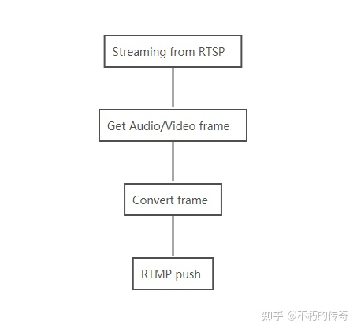

# RTMP 简介 
RTMP是`Real Time Messaging Protocol`（实时消息传输协议）的首字母缩写
__基于TCP__, 本身是一个协议族， 包括RTMP基本协议及RTMPT/RTMPS/RTMPE等多种变种
RTMP是一种设计用来进行实时数据通信的网络协议，主要用来在Flash/AIR平台和支持RTMP协议的流媒体/交互服务器之间进行音视频和数据通信   
提供双向的信息多元化服务,其目的是在两个通信节点间传输带有时间信息的音视频并发流。其实现会针对不同的消息种类分配不同的优先级，当传输能力有限时，这就会影响流传输的排队顺序。   

__应用层协议, 底层是使用的TCP传输协议__   


## 相关概念
* 负载(Payload): 分组中包含的数据，比如音频采样数据和视频压缩数据。
* 分组(Packet): 数据分组由固定头部和负载组成的。对于底层协议，可能需要定义分组的封装。
* 端口(Port): 用于区分不同的目标抽象，一般用整数表示，如TCP/IP中的端口号。
* 传输地址(Transport address): 网络地址和端口号的组合,用于标识一个传输层的端口。如IP地址+TCP端口号。
* 消息流(Message stream): 允许消息流动的逻辑上的通讯通道。
* 消息流ID(Message stream ID): 每隔消息都有与之关联的ID号，用于与其他消息流作区分。
* 块(Chunk): 一个消息片段。消息被放到网络上传输之前被切分成小的片段并被交错存取。分块确保跨流的所有消息按时间戳顺序被不断的传输。
* 块流(Chunk stream):
* 块流ID(Chunk stream ID): 每个块所关联的用于区分其他块流的ID。
* 复用(Multiplexing): 将音视频数据整合到一个数据流内,使得多个音视频数据流可以同步传输.
* 解复用(DeMultimplexing): 复用的反过程,交互的音视频数据被分成原始的音频数据和视频数据。
* 远程过程调用(Remote Procedure Call(RPC)):
* 元数据(Metadata): 数据的一个简单描述。如一部电影的电影名、时长、制作时间等等.
* 应用Instance（Application Instance): 对于服务器端的应用Instance，客户端就是通过连接该Instance来发送请求的.
* Action Message Format(AMF):


### 整体流程
  


### 消息格式 
根据上层协议，消息格式可以被分成多个块以支持复用。消息格式应包含如下字段，这对于创建块是必须的:
1. 时间戳(TimeStamp)：消息的时间戳，占 4 个字节。
2. 长度(Length): 消息的长度，包含头部。占头部中的3 个字节。
3. 类型Id(Type Id): 消息的类型 Id,占 1 个字节。
4. 消息流ID（Message Stream ID）: 每个消息的唯一标识，划分成 Chunk 和还原 Chunk 为 Message 时， 都是根据这个 ID 来辨识是否是同一个消息的 Chunk 的，占 4 个字节，并且以小端格式存储。


### 将streaming封装成为RTMP格式 
在发送第一帧Audio和Video的时候, 需要将Audio和Video的信息封装成为RTMP header, 发送给rtmp server  
* Audio头有4字节，包含：头部标记0xaf 0x00、 profile、channel、bitrate 信息。
* Video头有16字节，包含IFrame、PFrame、AVC标识，除此之外，还需要将sps和pps放在header 里面。

RTMP协议定义了`message Type`，其中Type ID为8，9的消息分别用于传输音频和视频数据：  


### Audio 格式封装 
__AAC header packet__  

```
body = (unsigned char *)malloc(4 + size);
memset(body, 0, 4);
body[0] = 0xaf;
body[1] = 0x00;

switch (profile){
 case 0:
    body[2]|=(1<<3);//main
    break;
 case 1:
    body[2]|=(1<<4);//LC
    break;
 case 2:
    body[2]|=(1<<3);//SSR
    body[2]|=(1<<4);
    break;
 default:
    ;
}
switch(this->channel){
 case 1:
    body[3]|=(1<<3);//channel1
    break;
 case 2:
    body[3]|=(1<<4);//channel2
    break;
 default:
    ;
}
switch(this->rate){
 case 48000:
    body[2]|=(1);
    body[3]|=(1<<7);
    break;
 case 44100:
    body[2]|=(1<<1);
    break;
 case 32000:
    body[2]|=(1<<1);
    body[3]|=(1<<7);
    break;
 default:
    ;
}
sendPacket(RTMP_PACKET_TYPE_AUDIO, body, 4, 0);
free(body);

```

### Video 格式封装 
__H264 header packet__  

```
body = (unsigned char *)malloc(16 + sps_len + pps_len);
this->videoFist = false;

memset(body, 0, 16 + sps_len + pps_len);
body[i++] = 0x17;   // 1: IFrame, 7: AVC
                    // AVC Sequence Header
body[i++] = 0x00;
body[i++] = 0x00;
body[i++] = 0x00;
body[i++] = 0x00;

// AVCDecoderConfigurationRecord
body[i++] = 0x01;
body[i++] = sps[1];
body[i++] = sps[2];
body[i++] = sps[3];
body[i++] = 0xff;
body[i++] = 0xe1;
body[i++] = (sps_len >> 8) & 0xff;
body[i++] = sps_len & 0xff;
for (size_t j = 0; j < sps_len; j++)
{
    body[i++] = sps[j];
}
body[i++] = 0x01;
body[i++] = (pps_len >> 8) & 0xff;
body[i++] = pps_len & 0xff;
for (size_t j = 0; j < pps_len; j++)
{
    body[i++] = pps[j];
}
sendPacket(RTMP_PACKET_TYPE_VIDEO, body, i, nTimeStamp);

free(body);


```


__只有第一帧Audio和第一帧video才需要发送header信息__  


发送Audio的时候，需要在数据帧前面加上2 byte的header信息:
```
spec_info[0] = 0xAF;
spec_info[1] = 0x01;
```


发送Video的时候，需要在header里面标识出I P帧的信息，以及视频帧的长度信息  
```
body = (unsigned char *)malloc(9 + size);
memset(body, 0, 9);
i = 0;
if (bIsKeyFrame== 0) {
    body[i++] = 0x17;   // 1: IFrame, 7: AVC
}
else {
    body[i++] = 0x27;   // 2: PFrame, 7: AVC
}
// AVCVIDEOPACKET
body[i++] = 0x01;
body[i++] = 0x00;
body[i++] = 0x00;
body[i++] = 0x00;

// NALUs
body[i++] = size >> 24 & 0xff;
body[i++] = size >> 16 & 0xff;
body[i++] = size >> 8 & 0xff;
body[i++] = size & 0xff;
memcpy(&body[i], data, size);

```


## 直播推流码率控制  
* CBR（Constant Bitrate）恒定码率  
   __一定时间范围内比特率基本保持恒定__  
   使用该模式时，在视频动态画面较多的场景下，图像质量会变差，而在静态画面较多的场景下，图像质量又会变好。  
* VBR（Variable Bitrate）可变码率  
   __其码率可以随着图像的复杂程度的不同而变化__  
   使用该模式时，在图像内容比较简单的场景下，分配较少的码率，而在图像内容复杂的场景下，则分配较多的码率。这样既保证了质量，又兼顾到带宽限制，优先考虑到图像质量。   
* ABR（Average Bitrate）平均比特率    
   是VBR的一种插值参数  
   简单场景分配较低码率，复杂场景分配足够码率，这一点类似VBR。同时，一定时间内平均码率又接近设置的目标码率，这一点又类似CBR。可以认为ABR是CBR和VBR的折中方案。    
* CRF（Constant Rate Factor）恒定码率系数  
   CRF值可以理解为对视频的清晰度和流畅度期望的一个固定输出值，即无论是在复杂场景还是在简单场景下，都希望有一个稳定的主观视频质量。   


## 关键帧间隔(Group of Pictures，GOP)  
> 指的是一组由一个I帧、多个P帧和B帧组成的一个帧序列。一帧就是视频中的一个画面，其中：  
* I帧（intra coded picture）  
   最完整的画面，自带全部信息，无需参考其他帧即可解码，每个GOP都是以I帧开始；   
* P帧（predictive coded picture）  
   帧间预测编码帧，需要参考前面的I帧或P帧，才能进行解码，压缩率较高；  
* B帧（bipredictive coded picture）  
   双向预测编码帧，以前帧后帧作为参考帧，压缩率最高。   

> 对于普通视频，加大GOP长度有利于减小视频体积，但是在直播场景下，GOP过大会导致客户端的首屏播放时间变长。__GOP越小图片质量越高，建议设为2秒，最长不要超过4秒。__       


## 常见直播协议 
* RTMP  
* HLS( HTTP Live Streaming)  
   * 这是 Apple 提出的直播流协议  
   * 两块内容是 .m3u8 文件和 .ts 播放文件  
   * 接收服务器会将接收到的视频流进行缓存，然后缓存到一定程度后，会将这些视频流进行编码格式化，同时会生成一份 .m3u8 文件和其它很多的 .ts 文件  
   * __跨平台性比较好__    
   * __时延比较高__  

* HTTP-FLV   
   *  Adobe 公司推出的另一种视频格式  
   * 其格式相对简单轻量，不需要很大的媒体头部信息   
   * 整个 FLV 由 The FLV Header, The FLV Body 以及其它 Tag 组成。因此加载速度极快   
     


