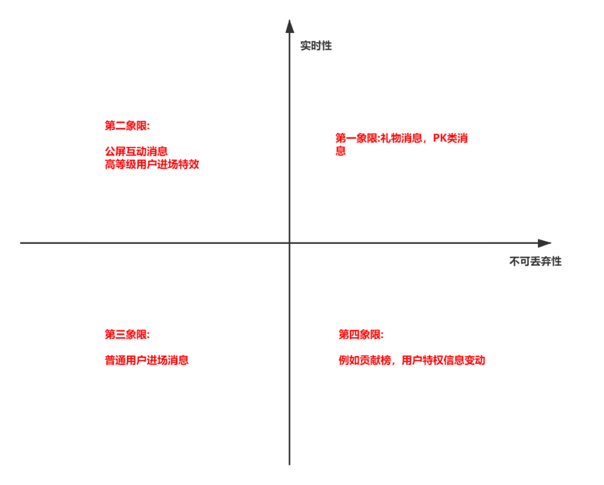

# 直播消息相关  

## 消息分类 
1. 通知类消息  
    例如送礼、弹幕、进场、榜单变化、等级变化等等消息  

2. 功能类消息 
    例如踢人、反垃圾审核、红包、PK消息等等     

  


## 消息分发方式 
1. IM 消息系统  
2. http短轮询  


### 1. http短轮询  
> 客户端每隔一个极短的时间，例如1秒亦或者更短的时间，根据直播间的id来调用服务端的接口，轮询该直播间发生的消息，服务端这边我们使用redis的SortedSet的数据结构来存储消息，其中key是直播间的房间id，score是服务器接收到该消息事件生成的时间戳，value可以简单地直接存储该消息序列化后的字符串，这样可以按照时间顺序地去存储消息，并且配置过期消息的删除逻辑，整个消息的存储就可以简单地搭建起来   

1. 消息存储  

```java

long time = new Date().getTime();
 
try {
     // redis中插入消息数据
     jedisTemplate.zadd(V_UNIQUE_ROOM_ID, time, JSON.toJSONString(roomMessage));
 
     // 按照概率性的去删除redis中过期的消息数据
     if (probability()) {
           deleteOverTimeCache(V_UNIQUE_ROOM_ID);
        }
     } catch (Exception e) {
            log.error("message save error", e);
 }
```


2. 过期消息丢弃  
```java 

private void deleteOverTimeCache(String roomId) {
 
        Long totalCount = jedisTemplate.zcard(roomId);
 
        log.info("deleteOldTimeCache size is {}", totalCount);
 
        if (totalCount < 600) {
            return;
        }
 
        // 倒序删除过期数据
        Set<Tuple> tuples = jedisTemplate.zrangeWithScores(roomId, -601, -1);
 
        if (CollectionUtils.isNotEmpty(tuples)) {
            for (Tuple tuple : tuples) {
                // 这是第一个-600条的那个score
                double score = tuple.getScore();
                jedisTemplate.zremrangeByScore(roomId, 0d, score);
                break;
            }
        }
    }

```
> probability， 按照随机概率判断该次请求是否要进行消息的删除， __删除的逻辑是放在插入的逻辑之中的。如果每一次插入都需要判断是否要删除过期数据，会影响插入的性能__   


3. 消息的查询 
> 通过直播间id和时间戳两个字段来请求服务端以查询直播间消息，其中"时间戳"是每一次服务端返回的，这个时间戳是渐进式的，当下一次客户端来请求服务端的数据的时候，都会带来上次服务端返回的时间戳   

```java 

@Override
 public RoomMessage queryRoomMessages(MessageMessageReq messageMessageReq) {
 
        RoomMessage result = new RoomMessage();
 
        long timestamp = messageMessageReq.getTimestamp();
 
        Set<Tuple> tuples = null;
        if (timestamp == 0) {
            // 如果传递是0，说明这个客户端终端是第一次来轮询，我们只要返回一个最近最新的消息返回即可
            tuples = jedisTemplate.zrevrangeWithScores(UNIQUE_ROOM_ID, 0, 0);
        } else
            // 加上一毫秒，返回后续的消息，每次返回5个，防止客户端因为低端手机原因，过多的消息渲染不出来
            tuples = jedisTemplate.zrangeByScoreWithScores(UNIQUE_ROOM_ID, timestamp + 1, System.currentTimeMillis(), 0, 5);
        }
 
        List<EachRoomMessage> eachRoomMessages = new ArrayList<>();
        long lastTimestamp = 0L;
 
        if (!CollectionUtils.isEmpty(tuples)) {
            for (Tuple tuple : tuples) {
                //最后一次循环后，会把最后一条消息产生的时间戳，返回给客户端，这样下次客户端就可以拿着这个时间戳来进行查询
                lastTimestamp = new Double(tuple.getScore()).longValue();
                eachRoomMessages.add(JSON.parseObject(tuple.getElement(), EachRoomMessage.class));
            }
        }
 
        result.setTimestamp(lastTimestamp);
        result.setEachRoomMessages(eachRoomMessages);
        return result;
    }
```

#### 可能的问题 
1. 断网的情况下，轮询的线程是不会停止的，导致再次联网后， 大量消息返回  
    客户端当出现网络问题的时候，在超过5秒以上，可以把时间戳置为0，要求服务端返回最新的直播间消息即可，中间丢失掉的消息，可以在业务返回内的进行丢弃   

